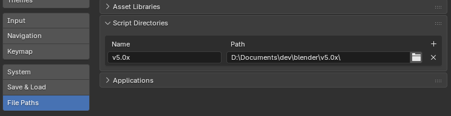
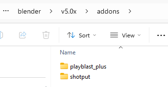

<p align="center">
  
</p>

# Playblast Plus

> A dedicated Blender addon port of [Playblast Plus for Maya/3ds Max](https://github.com/TheLineAnimation/playblast-plus) — capture a quick, un-rendered viewport animation directly from Blender's 3D Viewport and encode it to MP4 via FFmpeg.

   

---

## Why a separate addon?

Playblast Plus already runs in Maya and 3ds Max via a shared codebase built around a common abstraction layer and a Qt-based UI (PySide6). Blender's architecture made adopting that same structure impractical for two reasons:

1. **Blender's Python API is deeply tied to `bpy`** — the scene, render settings, viewport state and UI all live inside Blender's own data model, which is architecturally very different from Maya's OpenMaya/Qt stack.
2. **Blender and PySide have a complicated relationship** — embedding a PySide6 window inside Blender reliably is fragile and not officially supported.

The right call was a clean, idiomatic Blender addon using native `bpy.types.Panel`, `bpy.types.Operator` and `AddonPreferences` — same *intent* as the original, purpose-built for how Blender actually works.

---

## Features

- Captures the active 3D viewport frame range as a PNG sequence
- Encodes to **H.264 MP4** via FFmpeg (auto-download supported on Windows, Linux, macOS)
- **Tokenized output filenames** — `<scene>_<camera>_<user>` etc.
- Shading and overlay overrides per capture
- Burn-in overlay support (MP4 mode)
- Half-resolution capture option
- AYON pipeline integration — extra tokens registered automatically when AYON env vars are detected
- Experimental **APNG output** mode (see below)

---

## Installation

### From zip (recommended)

1. Download or build a `.zip` of this repository
2. In Blender: **Edit → Preferences → Add-ons → Install from Disk**
3. Enable **Playblast Plus** in the add-ons list

### Manual (development)

Clone the repo and copy the folder into your Blender addons directory, or use `_deploy.py` (see [Developer setup](#developer-setup) below).

**Requires Blender 4.2 or later.**

---

## Usage

Open the **N-panel** in the 3D Viewport and switch to the **Playblast Plus** tab.

1. Set your output token (e.g. `<scene>_<camera>`)
2. Choose shading / overlay overrides
3. Hit **Playblast** — frames are captured and encoded to MP4 in your output folder

FFmpeg is required for MP4 encoding. If it isn't found, the panel shows an **Install FFmpeg** button that downloads it automatically.

---

## Experimental: APNG output

> A side project exploring whether viewport captures can be transcoded into an optimised **Animated PNG (APNG)** — a format that supports full alpha transparency and is natively supported in browsers and Discord without any codec negotiation.
>
> [Read more about APNG on Wikipedia](https://en.wikipedia.org/wiki/APNG)

<table align="center"><tr>
  <td align="center"><br/><sub>GIF — 337 KB</sub></td>
  <td align="center"><br/><sub>APNG — 379 KB</sub></td>
</tr></table>

<p align="center"><sub>Demo images via <a href="https://apng.onevcat.com/demo/">apng.onevcat.com</a></sub></p>

Switch **Output Format** to **APNG** in addon preferences. In this mode:

- Frames are assembled into an APNG using [apngasm](https://apngasm.sourceforge.net/) instead of FFmpeg
- Transparency capture is supported (`film_transparent` override)
- Optional post-compression via the [Tinify API](https://tinify.com/developers)
- **Resolution presets** (`apng-presets.json`) let you quickly set Blender's scene resolution and frame rate to match a target platform (e.g. Discord profile effects at 450×880 @ 12 fps)

APNG assembly can be slow at higher resolutions. The **APNG Encode Timeout** preference (default 300 s) controls how long to wait before aborting.

### apng-presets.json

Edit `apng-presets.json` in the addon folder to add your own presets:

```json
{
  "presets": [
    {
      "name": "my_preset",
      "label": "My Preset",
      "width": 512,
      "height": 512,
      "framerate": 24
    }
  ]
}
```

Presets appear in the panel dropdown. Selecting one **previews** the resolution — it only applies to the scene when you press **Apply to Scene**.

---

## Third-party tools

<p align="left">
  
</p>

[FFmpeg](https://ffmpeg.org/) — the backbone of the MP4 encode step. An industry-standard, open-source multimedia framework. Installed locally and referenced by the addon; never bundled in the repository.

### apngasm

[apngasm](https://apngasm.sourceforge.net/) — an open-source command-line tool for assembling Animated PNG files from a PNG frame sequence. All credit to the apngasm developers and contributors for this excellent utility. Given it's tiny footprint compared to Ffmpeg, the `apngasm.exe` (v2.9.1) binary is included in this repository.

- Source: [APNG Info](https://en.wikipedia.org/wiki/APNG)
- Licence: zlib/libpng

---

## File structure

```
b3d-playblast-plus/
├── __init__.py             # Addon entry point — register / unregister
├── operators.py            # bpy.types.Operator subclasses
├── preferences.py          # AddonPreferences subclass
├── props.py                # Scene-level RNA properties
├── ui.py                   # bpy.types.Panel / Menu subclasses
├── blender_manifest.toml   # Extension manifest (Blender 4.2+)
├── apng-presets.json       # Editable APNG resolution presets
├── .env.example            # Template for local developer config
├── _deploy.py              # Dev helper — version bump + local deploy
├── bin/                    # apngasm.exe
└── lib/
    ├── apng_presets.py     # APNG preset loader
    ├── bases.py            # Shared base classes
    ├── blender_logger.py
    ├── blender_preview.py  # Viewport capture logic
    ├── blender_scene.py    # Scene / path helpers
    ├── custom_icons.py
    ├── encode.py           # FFmpeg + apngasm encode wrappers
    ├── ffmpeg_utils.py     # FFmpeg discovery and auto-install
    ├── register_tokens.py  # Token registration (incl. AYON tokens)
    ├── tinify_client.py    # Stdlib-only Tinify API client
    ├── tokens.py           # Token system
    └── utils.py
```

---

## Developer setup

Copy `.env.example` to `.env` and fill in your local paths:

```
DEPLOY_PATH=C:\path\to\blender\addons
TINIFY_API_KEY=your_key_here
```

Then run `_deploy.py` to bump the version and copy the addon to your Blender install:

```
python _deploy.py          # patch bump (default)
python _deploy.py minor    # minor bump
python _deploy.py major    # major bump
python _deploy.py skip     # deploy without version bump
```

`.env` is git-ignored and will never be committed.

Add the deploy path to your Blender script directories - you can add any number of addons into this location and have them pick up for development testing. I know this isn't the Blender approved workflow, but I find this to work best for me for rapid development and iterative testing.



Blender looks for an `addons` folder inside this path -



---

## License

GPL-3.0-or-later — see [SPDX:GPL-3.0-or-later](https://spdx.org/licenses/GPL-3.0-or-later.html).
